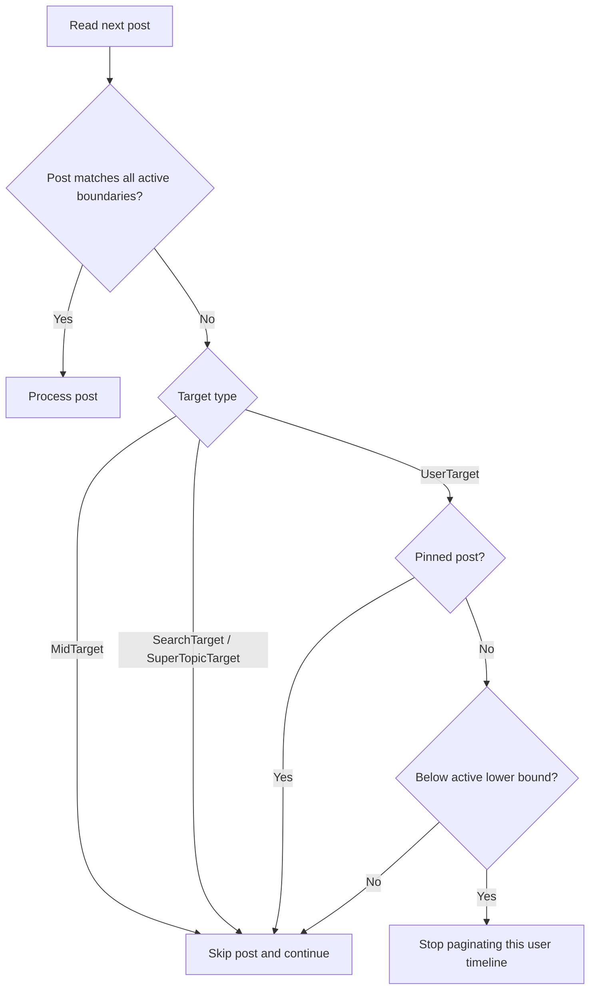

<div align="center">

# weiboloader

*A Python CLI for downloading media from [Weibo](https://weibo.com), inspired by [instaloader](https://github.com/instaloader/instaloader).*
*Built for reliable repeat runs with resumable progress, flexible filters, and customizable output layouts.*

[](https://www.python.org)
[](LICENSE)

</div>

## Highlights

- Download from user timelines, supertopics, search keywords, or individual posts (MID / URL)
- Resume interrupted runs and skip already covered ranges on repeat downloads
- Filter downloads by date range or MID range
- Customize output directories and filenames with template patterns
- Import cookies from browsers, strings, files, or reusable sessions
- Use Playwright-assisted visitor-cookie and captcha flows when needed
- Save metadata as JSON or plain-text sidecar files
- Control request pacing and concurrent media downloads
- Align newly written file timestamps with post timestamps

## Stability notes

> [!WARNING]
> Resume and incremental state handling are still stabilizing in the `0.1.x` series. After interruptions, partial downloads, or option changes, recovery behavior may still evolve. If a resumed run looks wrong, retry with `--no-resume` or remove the matching entry under `output_dir/.progress/`.

> [!WARNING]
> Newly downloaded media and metadata files can use the source post timestamp as their modified time. This behavior is still considered early and may vary across platforms or filesystems. If applying the timestamp fails, the current artifact may be treated as failed and removed.

> [!NOTE]
> `--post-filter` is included for future compatibility and is not active in `v0.1.0`.

## Installation

```bash
pip install .
```

### Optional extras

```bash
# Load cookies from local browser (Chrome/Firefox/Edge)
pip install ".[browser]"

# Visitor cookies and automatic captcha flow
# Also requires: playwright install chromium
pip install ".[captcha]"
```

### For development

```bash
pip install ".[dev]"
```

## Usage

```bash
# Download by user UID
weiboloader 1234567890

# Download by nickname
weiboloader nickname

# Download supertopic
weiboloader "#TopicName"

# Search keyword
weiboloader ":keyword"

# Single post by MID
weiboloader -mid 5120000000000000

# Single post by URL
weiboloader "https://m.weibo.cn/detail/5120000000000000"
```

### Where files are saved

- CLI downloads are written to the current working directory by default.
- Download state is stored in `./.progress/` under that output root.
- Use `--dirname-pattern` and `--filename-pattern` to customize directory and file layout.

### Authentication

```bash
# Import cookies from browser
weiboloader --load-cookies chrome 1234567890

# Cookie string
weiboloader --cookie "SUB=xxx; SUBP=yyy" 1234567890

# Cookie file
weiboloader --cookie-file cookies.txt 1234567890

# Reuse a saved session after the first successful login
weiboloader --sessionfile session.dat --cookie "SUB=xxx" 1234567890

# Auto-fetch visitor cookies (requires playwright)
weiboloader --visitor-cookies 1234567890
```

- `--load-cookies` supports `chrome`, `firefox`, and `edge` (`pip install ".[browser]"`).
- `--visitor-cookies` requires `pip install ".[captcha]"` and `playwright install chromium`.
- `--sessionfile FILE` lets you persist and reuse an authenticated session.

### Filter by date or post ID

```bash
# Inclusive date range
weiboloader -b 20240101:20240131 1234567890

# Open-ended date range
weiboloader -b :2024-01-31 1234567890

# Inclusive MID range
weiboloader -B 5110000000000000:5120000000000000 1234567890
```

- `-b, --date-boundary` accepts inclusive `START:END` ranges with `YYYYMMDD` or `YYYY-MM-DD` endpoints.
- `-B, --id-boundary` accepts inclusive decimal MID ranges.
- Both boundary options support open-ended ranges such as `START:` or `:END`.

#### Boundary traversal behavior

- `UserTarget` may stop pagination early once a **non-pinned** post falls below the active lower bound (`-b` start date or `-B` start MID).
- Pinned posts are ignored for this cutoff check, so an out-of-range pinned post does **not** prevent later in-range posts from being scanned.
- `SearchTarget` and `SuperTopicTarget` always keep scanning even when an individual post is out of range.
- `MidTarget` never uses lower-bound cutoff logic; it simply skips the single post if it is out of range.
- `-b, --date-boundary` compares by **calendar date** (not time-of-day). Naive timestamps are interpreted as CST (`UTC+08:00`).



### Save metadata files

```bash
# Save raw metadata JSON next to each post
weiboloader --metadata-json 1234567890

# Also write a plain-text note into <mid>.txt for each post
weiboloader --metadata-json --post-metadata-txt "downloaded by weiboloader" 1234567890
```

- `--metadata-json` writes `<mid>.json` beside the downloaded media.
- `--post-metadata-txt TXT` writes the text you provide into `<mid>.txt`; no template expansion is performed.

### Common options

This is a summary of the most useful CLI options. For the exact current CLI reference, run `weiboloader --help`.

```
-mid, --mid MID          Download a single post by MID
--load-cookies BROWSER   Import cookies from chrome|firefox|edge
--cookie TEXT            Set cookies from a raw cookie string
--cookie-file FILE       Load cookies from a cookie file
--sessionfile FILE       Persist and reuse an authenticated session
--visitor-cookies        Auto-fetch visitor cookies via Playwright
--no-videos              Skip video downloads
--no-pictures            Skip picture downloads
--metadata-json          Save post metadata as JSON
--post-metadata-txt TXT  Write the provided text to <mid>.txt per post
--dirname-pattern PAT    Directory naming pattern
--filename-pattern PAT   File naming pattern (default: {date}_{name})
--post-filter EXPR       Reserved for future releases; not active in v0.1.0
-b, --date-boundary      Inclusive START:END date range
-B, --id-boundary        Inclusive START:END MID range
--count N                Limit the number of posts (0 = unlimited)
--fast-update            Stop early when existing output indicates older content
--no-resume              Disable resume support for interrupted runs
--no-coverage            Disable incremental skipping based on saved coverage
--request-interval SEC   Minimum delay between requests (default: 1)
--api-rate-limit N       API request quota per window (default: 60)
--api-rate-window SEC    Length of the API quota window in seconds (default: 600)
--workers N              Concurrent media downloads (default: 1)
--captcha-mode MODE      auto|browser|manual|skip (default: auto)
```

### Progress persistence

- `weiboloader` stores download state in `output_dir/.progress/` to support resumed runs and incremental skipping.
- Saved state is only reused when the relevant output and filter options still match.
- A fully successful target clears `resume` but keeps `coverage` for later incremental runs.
- Interrupted or failed runs keep the last safe `resume` point and commit completed coverage ranges.
- Use `--no-resume` to ignore saved resume state, or `--no-coverage` to disable coverage-based skipping.
- Ctrl+C flushes the current progress state before exit.

### Post timestamps on downloaded files

- Newly downloaded media files use the source post timestamp as their modified time (`mtime`).
- Metadata files created by `--metadata-json` and `--post-metadata-txt` follow the same rule.
- Existing non-empty files that are skipped keep their current timestamp.
- Empty files that are downloaded again receive a fresh post-aligned timestamp.

### Request limits and concurrency

- By default, API requests are paced with a quota of 60 requests per 600 seconds.
- Adjust pacing with `--api-rate-limit`, `--api-rate-window`, and `--request-interval`.
- Media downloads are paced separately from API quota tracking and use 1 worker by default.
- Increase `--workers` if you want more concurrent media downloads.

### Filename and directory templates

Available template variables:

| Variable | Description |
|----------|-------------|
| `{nickname}` | User nickname |
| `{uid}` | User ID |
| `{mid}` | Post MID |
| `{bid}` | Post BID |
| `{date}` | Timestamp (default: `%Y-%m-%d`) |
| `{date:%Y-%m-%d}` | Custom date format |
| `{text}` | Post text (truncated to 50 chars) |
| `{index}` | Media index |
| `{index:3}` | Zero-padded index |
| `{type}` | Media type (picture/video) |
| `{name}` | Original filename when available |
| `{topic_name}` | Supertopic name |
| `{keyword}` | Search keyword |

## Python API (advanced)

```python
from weiboloader import WeiboLoader, UserTarget
from weiboloader.context import WeiboLoaderContext
from weiboloader.ratecontrol import SlidingWindowRateController

ctx = WeiboLoaderContext(
    rate_controller=SlidingWindowRateController(),
    captcha_mode="auto",
)
ctx.set_cookies_from_string("SUB=xxx")

loader = WeiboLoader(ctx, count=10, no_coverage=False)
loader.download_target(UserTarget(identifier="1234567890", is_uid=True))
```

## License

GPLv3
